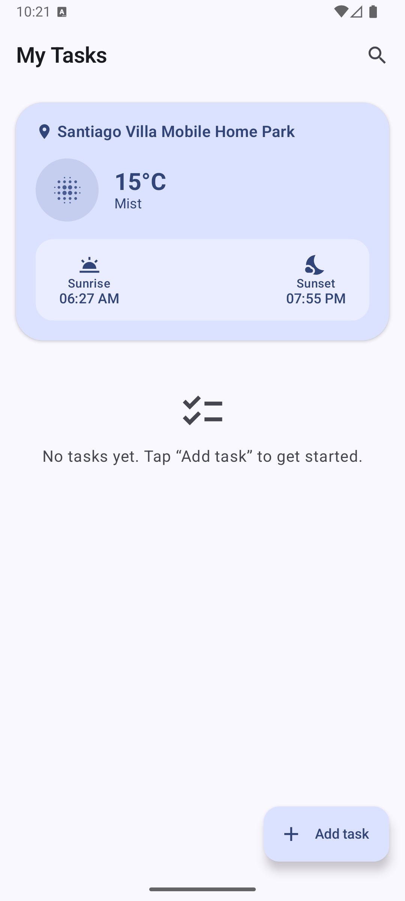
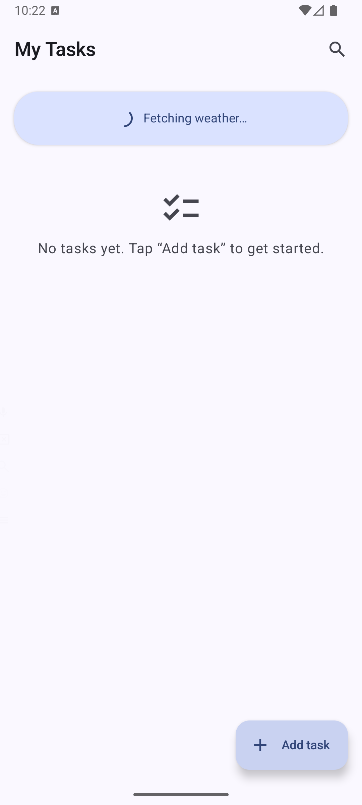
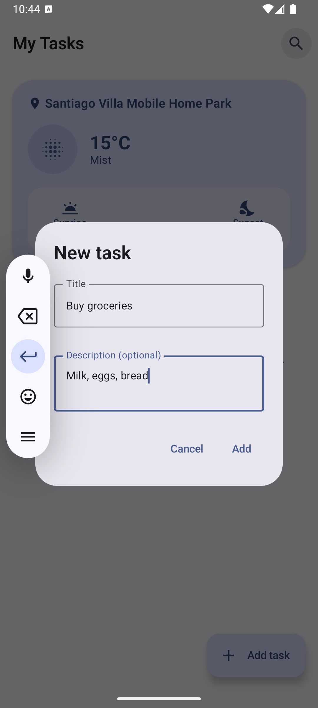
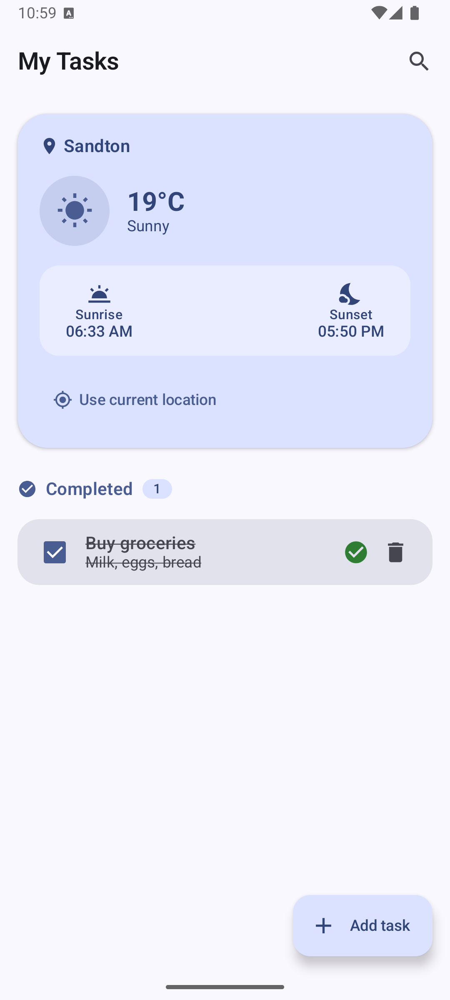
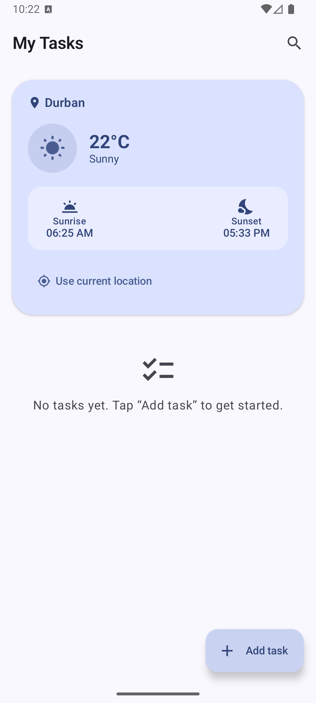

# TODOList

A TODO list app with live weather context (current temperature, sunrise/sunset), built with
Kotlin, Jetpack Compose, and a modularized clean architecture (MVVM).

## Screenshots

| Landing | Fetching weather | Add a task |
| --- | --- | --- |
|  |  |  |

| Mark a task done | Search a location (Durban) |
| --- | --- |
|  |  |

## Setup

1. Get a free API key from [weatherapi.com](https://www.weatherapi.com/) (Sign Up → free plan).
2. Add it to `local.properties` (not checked into version control):

   ```
   WEATHER_API_KEY=your_key_here
   ```

3. Build and run. On first launch the app requests location permission to fetch local weather;
   the todo list works regardless of whether it's granted.

## Architecture

Modularized clean architecture, each feature split into `domain` / `data` / `presentation`:

- `core:common` — cross-cutting utilities (`AppResult`, `DispatcherProvider`).
- `core:ui` — Material 3 theme (light/dark + dynamic color), shared composables.
- `core:database` — Room (`TaskEntity`, `TaskDao`, `AppDatabase`).
- `core:network` — generic Retrofit/OkHttp networking layer (`RetrofitFactory`, `safeApiCall`).
- `core:location` — `FusedLocationProviderClient` wrapper.
- `feature:todo` — add/complete/delete tasks, persisted locally via Room.
- `feature:weather` — current temperature, sunrise, sunset for the device's location, via
  [WeatherAPI](https://www.weatherapi.com/docs/) `forecast.json`.
- `app` — Hilt wiring, `MainActivity`, permission flow, screen composition.

Dependency injection via Hilt; navigation between the weather header and the todo list is
composed directly (single-screen app) rather than through Navigation Compose, since there's
only one destination.

### SOLID

- **Single Responsibility** — each layer has one reason to change: `TaskRepositoryImpl` only
  adapts Room to the domain, `TodoViewModel` only tracks todo UI state, `WeatherViewModel` only
  tracks weather UI state. Permission handling is its own unit
  (`rememberLocationPermissionState`) rather than living inside `MainScreen`, so screen
  composition and the Android permission flow can change independently.
- **Open/Closed** — `GetCurrentWeatherUseCase` and `SearchWeatherUseCase` both build a query
  string and hand it to the same `WeatherRepository.getWeather(query)`. A new way to resolve a
  location (e.g. IP-based) is a new use case, with no change to `WeatherRepository` or its
  implementation.
- **Liskov Substitution** — `DefaultLocationClient` honors `LocationClient`'s contract exactly
  (returns `null` on any failure - missing permission, disabled services, no fix - never
  throws), so callers never need to know which implementation they're holding.
- **Interface Segregation** — `TaskRepository` and `WeatherRepository` only expose the
  operations their callers actually use; `LocationClient` and `DispatcherProvider` are
  single-method/property interfaces rather than one large "core" interface.
- **Dependency Inversion** — `TodoViewModel`/`WeatherViewModel` depend on domain interfaces
  (`TaskRepository`, `WeatherRepository`, `LocationClient`), never on Room, Retrofit, or
  `FusedLocationProviderClient` directly; those concrete types are wired in only at the Hilt
  `@Module` boundary (`data/di`), which is also why `core:common`, `core:ui`, and the domain
  layers of each feature have zero Android-framework or networking dependencies.

## Tests

Unit tests cover use cases, repositories, mappers, and the `TodoViewModel` across
`core:common`, `feature:todo`, and `feature:weather`, using JUnit4, MockK, Turbine, and Truth.

```
./gradlew test
```
